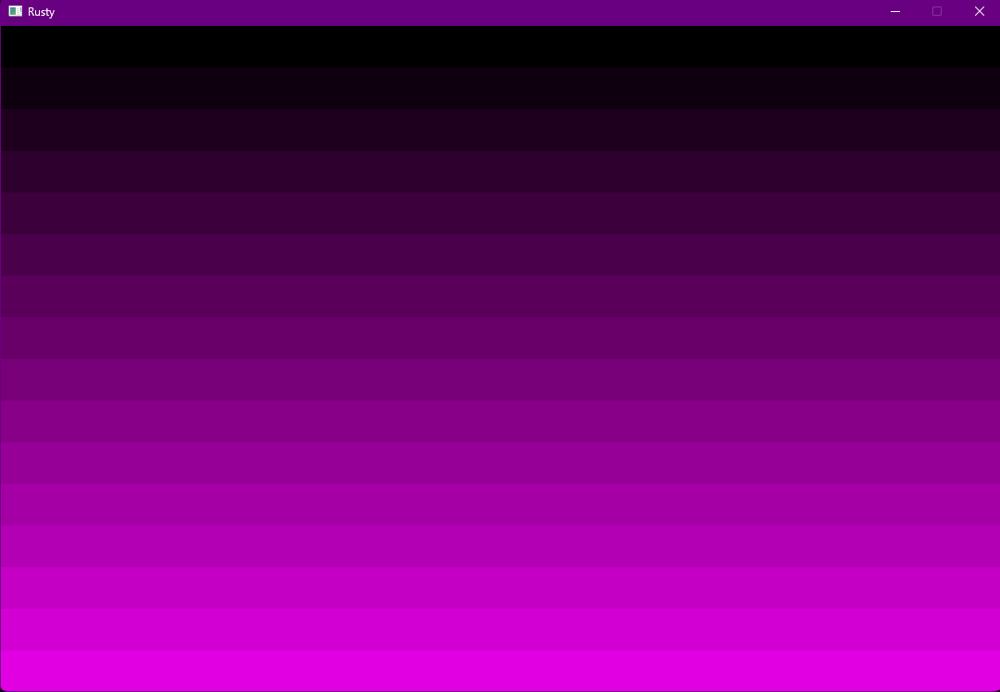
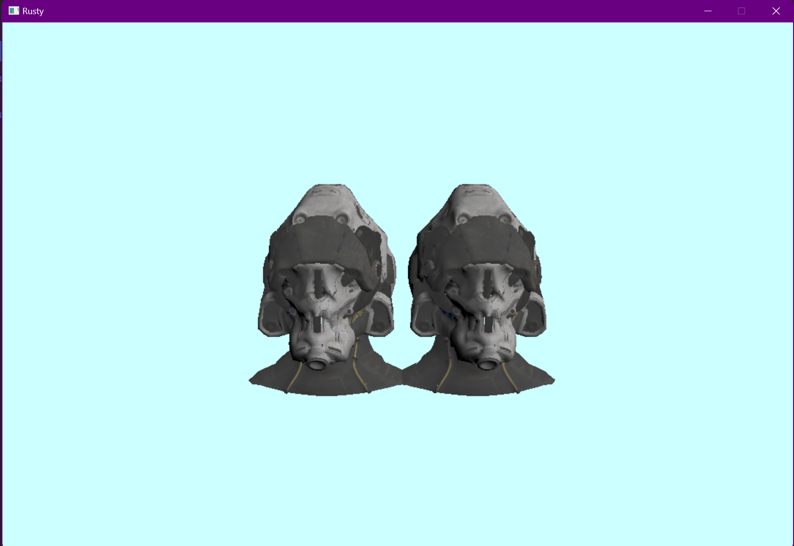

# A little Rusty (Rusteferizer)
Name: Angel Georgiev 

BUass email: 210798@buas.nl

## Features
> Provide a detailed list of the features implemented
> Feel free to provide link to the code that implements te features. (in GitHub you can just click on a line of code and get the link to it)

+ Model Loading
+ Texture loading
+ Rasterization of models with textures
+ Thread manager (pool) used for multi-threaded model loading (did not have the time to completely figure out how to multithred the rasterization itself, however, I belive I am close to doing it, I jsut need more knowledge in Rust and how to structure my codebase in a thread-friendly :) way) Can be seen clearly in debug since gltf loads the models extremely slow in debug.
+ UI with egui (https://crates.io/crates/egui) was planned but dropped due to lack of time (will continue to work towards it though)

## Showcase
> Provide screenshots/videos/gifs to showcase your software rasterizer.  
> Make sure to showcase the coolest features implemented and mention what each media is showcasing.  
> If you want to use videos, it's recommended to upload them on youtube instead of github and just embed them in this Markdown file.

> Each thread is given a section of the screen buffer (divided into 16 strips) and a different color to clear it to
> How it's done: https://github.com/angelG02/Rusty/blob/75648bb6ab17c1826d66480530338b7077e1715f/src/main.rs#L98

> Each thread is given a model to load and then pushes it into a vector of models. Only when that vector is not empty are the models drawn, unti then a model loaded on te main thread is drawn only (or it can be a loading screen or anything else that is easy to render and load). As I said, the difference is much more noticable in debug, where (if not multi-threaded) the window is not even displyed until all the models are loaded.